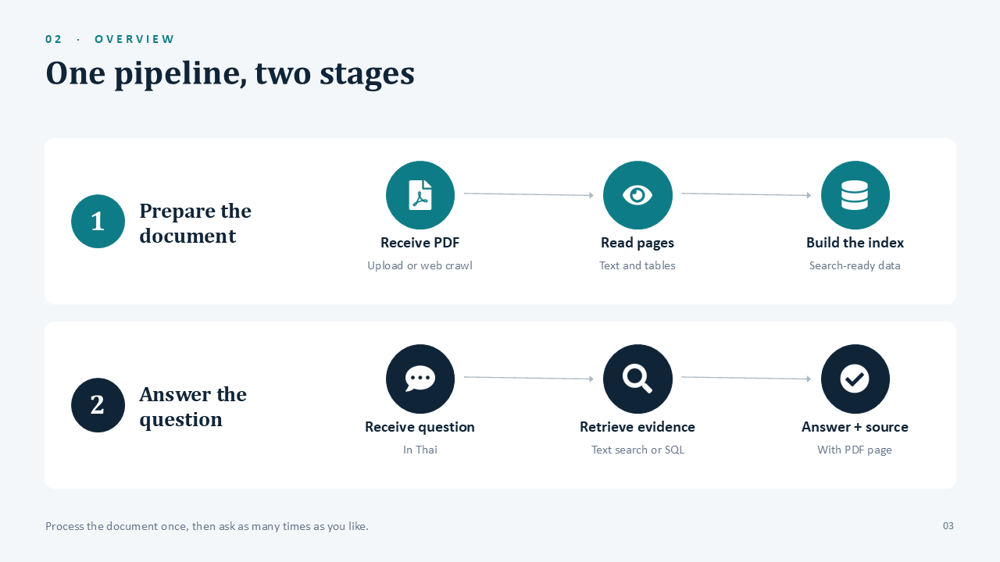
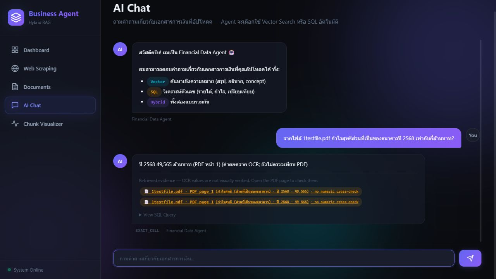

# รายงานความคืบหน้าและข้อมูลทางเทคนิคสำหรับเรียบเรียงต่อ

วันที่จัดทำ 4 ตุลาคม 2569 | ผลทดลองถึง 2 ตุลาคม 2569 | branch auto1 | code commit 5b0aaf5

เนื้อหานี้เป็นข้อมูลต้นทางสำหรับปรับภาษาและจัดทำรายงาน ความเห็นเรื่องความพร้อมต้องแยกจากผลวัดจริง ไม่ให้เปลี่ยนคะแนนชุดพัฒนาเป็นความแม่นยำทั่วไป และไม่ถือว่ารายงานนี้ผ่านการรับรองเฉลยจากมนุษย์แล้ว

## รายงานความคืบหน้าโครงงาน

Agentic RAG Business Insight Analysis

ระบบถามตอบจากรายงานธุรกิจภาษาไทยพร้อมหลักฐานอ้างอิง
ผู้จัดทำ Jakkrapat  รหัสนักศึกษา 66070026
เสนออาจารย์ที่ปรึกษา  |  วันที่ 4 ตุลาคม 2569

### สรุปความคืบหน้าสำหรับอาจารย์

โครงงานพัฒนาระบบหลักสำหรับนำเข้า PDF ค้นข้อมูล และตอบคำถามพร้อมเปิดหน้าหลักฐานได้แล้ว รอบล่าสุดเน้นแก้ปัญหา “มีข้อมูลแต่ค้นไม่พบ” และ “ค้นพบหน้าแล้วแต่หยิบค่าคนละรายการ” โดยปรับขอบเขตบริษัท การเก็บบริบททั้งหน้า และการส่งหลักฐานไปถึงขั้นสร้างคำตอบ

ผลที่มีอยู่สนับสนุนว่าระบบดีขึ้นบนชุดวินิจฉัยที่ใช้พัฒนา แต่ยังต้องตรวจเฉลยโดยอิสระและทดสอบกับรายงานไทยชุดใหม่ก่อนสรุปความแม่นยำทั่วไป รายงานนี้สรุปหลักฐานถึงการทดลองวันที่ 2 ตุลาคม 2569 และจัดทำเอกสารวันที่ 4 ตุลาคม โดยไม่ได้รันทดลองใหม่เพื่อจัดทำรายงาน

| สิ่งที่ตรวจ | ผลที่บันทึกไว้ล่าสุด | ขอบเขต |
| --- | --- | --- |
| พฤติกรรมโค้ด | 206 ผ่าน  5 ข้าม | แบบทดสอบบริการและตัวประเมิน |
| ค้นหน้าหลักฐาน PTT/PTTEP | 16/16 ข้อ ใน Top 5 | ชุดวินิจฉัย 16 ข้อบน 3 หน้า |
| ตอบและมีหน้าใน sources | 15/16 ข้อ หรือ 93.75% | ยังไม่ใช่ความถูกต้องการอ้างอิงทุกประโยค |
| คำถามจากฐานข้อมูลจริง | 14/15 ข้อ หรือ 93.3% | ชุดเดิมที่ใช้ปรับระบบแล้ว |
| โหมดในเครื่องด้วย Docling | ประมวลผล 5/5 หน้า ตอบ 0/1 | OCR ไทยยังจำกัดคุณภาพคำตอบ |

ส่วนที่พร้อมนำเสนอคือกระบวนการทำงาน การสาธิตจากเว็บจริง และผลทดลองที่ตรวจย้อนกลับได้ ส่วนที่ยังต้องทำให้ครบก่อนปิดผลวิจัยคือคุณภาพตารางและการอ้างอิง การทดสอบเต็มระบบกับไฟล์ยาว และการทดสอบสุดท้ายด้วยรายงานที่ไม่เคยใช้ปรับระบบ [E1–E3]

## 1  วัตถุประสงค์และกระบวนการทำงาน

รายงานธุรกิจมีทั้งข้อความ ตาราง และกราฟจำนวนมาก ผู้ใช้ต้องการถามเป็นภาษาไทยแล้วได้ข้อมูลที่ตรงบริษัท ปี และรายการ พร้อมตรวจกลับไปยัง PDF ได้ โครงงานจึงแยกงานเตรียมเอกสารออกจากงานตอบคำถาม เพื่อให้เอกสารที่จัดเก็บแล้วนำกลับมาถามได้หลายครั้ง


ภาพที่ 1 แผนภาพกระบวนการจากสไลด์โครงงาน แสดงส่วนเตรียมเอกสารและส่วนตอบคำถาม เป็นภาพอธิบายสถาปัตยกรรม ไม่ใช่ผลทดสอบ

### ลำดับการทำงาน

1. รับ PDF จากผู้ใช้หรือเว็บไซต์ แล้วส่งเข้าสู่เส้นทางประมวลผลร่วมกัน เก็บสถานะรายหน้าและข้อมูลต้นทาง
2. แปลงหน้าเป็นข้อความและข้อมูลตาราง ตรวจคุณภาพก่อนนำข้อมูลไปค้นหา และเก็บ checkpoint สำหรับทำต่อ
3. สร้างดัชนีข้อความและ embeddings พร้อมจัดเก็บข้อมูลตัวเลขที่มีบริบท
4. รับคำถาม ตรวจว่ามีข้อมูลในเครื่องมือใด แล้วค้นหลักฐานตามประเภทคำถาม
5. รวบรวมบริบท ตรวจคำตอบ และแสดงแหล่งข้อมูลให้ผู้ใช้เปิดหน้า PDF

| ส่วนประกอบ | หน้าที่ในระบบ |
| --- | --- |
| Typhoon และ Gemini | โหมดออนไลน์ใช้ Typhoon อ่านข้อความ และ Gemini จัดการตาราง รวมถึงเลือกเครื่องมือและสร้างคำตอบ |
| PostgreSQL และ bge-m3 | เก็บข้อความและค้นหลักฐานจากคำและความหมาย |
| DuckDB | ค้นและคำนวณจากข้อมูลตัวเลขที่ผ่านเกณฑ์และมีบริบท |
| Knowledge Graph | รองรับข้อมูลความสัมพันธ์เมื่อมีข้อมูลพร้อมใช้ ผลทดลองหลักในรายงานนี้ไม่ได้พิสูจน์คุณภาพกราฟ |
| Docling และโมเดลในเครื่อง | เส้นทาง local แยกจากโหมดออนไลน์ ต้องประเมินคุณภาพ OCR ไทยเพิ่มเติม |

## 2  สิ่งที่พัฒนาและปรับปรุงแล้ว

การรวมแนวทางจาก branch ทดลองมุ่งแก้จุดที่หลักฐานสูญหายระหว่างการค้นและการตอบ จากนั้นตรวจซ้ำในระบบปัจจุบัน โดยเก็บผลแต่ละรอบแยกกัน การปรับล่าสุดอยู่ใน commit 5b0aaf5 บน branch auto1 [E1]

| ปัญหาที่พบ | วิธีปรับระบบ | สิ่งที่ตรวจได้ |
| --- | --- | --- |
| ไฟล์เข้าได้หลายเส้นทาง | ให้อัปโหลดและ PDF จากเว็บใช้การประมวลผลร่วม พร้อมสถานะหน้าและ checkpoint | ติดตามหน้าที่ผิดพลาดและที่ต้องทำต่อ |
| ชื่อบริษัทย่อปะปนกัน | กำหนดขอบเขตตัวอักษรในการจับชื่อ เช่น PTT ไม่ไปตรงคำนำหน้าของ PTTEP | มี regression test ชื่อบริษัทสั้น |
| ค้นพบหน้าแต่ค่าท้ายหน้าหาย | ขยายผลค้นเป็นบริบทหน้าเดียวกัน แล้วส่งต่อผ่าน tool → sources → answer | ทดสอบการคงค่าท้ายหน้าและข้อความอ้างอิง |
| ตัวเลขอยู่คนละหัวข้อ | ใช้หัวข้อที่ระบุในคำถามช่วยคัดหน้าที่ค้นพบ และกำชับปี หน่วย สกุลเงิน | F16 เลือก 73% ของส่วนที่ถามได้ |
| ใช้ SQL ทั้งที่ไม่มีข้อมูล | ตรวจข้อมูลก่อนเปิดเครื่องมือ ลดการเรียกซ้ำ และตอบจากเซลล์ได้ในกรณีตรงรายการ | ชุดฐานข้อมูลจริงใช้ 22 calls สำเร็จ |
| ข้อมูลไม่มีที่มาชัดเจน | เก็บบริบทเซลล์และหน้า กักรายการที่ไม่ผ่านเกณฑ์ และนำข้อมูลเก่าที่ใช้ทดสอบเข้าใหม่ | ยังเหลือ OCR ผิดเลขใน L11 |
| คะแนนเกินจริงจากตัวตรวจ | แยกชั้นการประเมิน ตรวจเครื่องหมาย ปี หน่วย สเกล และเก็บรุ่นเฉลย | ไม่แก้คะแนนเก่าทับและไม่ผ่อนเกณฑ์ F10 |

### เหตุผลที่ต้องเก็บบริบทถึงขั้นตอบ

การค้นพบหน้าเป้าหมายยังไม่เพียงพอ หากระบบตัดข้อความก่อนส่งเข้าโมเดล ตัวเลขหรือชื่อแถวอาจหายไป การแก้ล่าสุดจึงรักษาบริบทตลอดเส้นทาง โดยจำกัดแต่ละหน้าไว้ไม่เกิน 12,000 ตัวอักษร และบริบทคำตอบรวมไม่เกิน 16,000 ตัวอักษร ขีดจำกัดนี้ควบคุมขนาดข้อมูล แต่ยังอาจตัดหน้าที่ยาวมากได้

Agent จำกัดการเรียกเครื่องมือในลูปหลักไว้ 2 ครั้ง และจำกัดรอบคิดตามค่าที่กำหนดสูงสุด 3 รอบ จำนวนนี้ไม่เท่ากับจำนวนเรียกโมเดลทั้งหมด เพราะยังมีขั้นสร้างคำตอบ ตรวจคำตอบ และการลองใหม่เมื่อบริการขัดข้อง [E1, E2]

## 3  วิธีประเมินและชุดข้อมูลที่ใช้

### แยกสิ่งที่วัดเป็นสามชั้น

| ชั้น | เกณฑ์ที่ตรวจ | สิ่งที่คะแนนไม่ยืนยัน |
| --- | --- | --- |
| OCR และตาราง | ข้อความ ค่า ความสัมพันธ์แถว คอลัมน์ ปี หน่วย และหน้า | มีข้อความออกมาไม่ได้แปลว่าอ่านถูก |
| การค้นหลักฐาน | หน้าเป้าหมายอยู่ในผลค้น 5 อันดับแรก หรือ page Hit@5 | พบหน้าถูกยังอาจส่งข้อความไม่ครบ |
| คำตอบและหลักฐาน | ข้อเท็จจริงผ่านเกณฑ์ และมีหน้าอ้างอิงที่กำหนดใน sources | การมีหน้าในรายการยังไม่ตรวจทุกประโยคหรือทุกเซลล์ |

ตัวอย่าง page Hit@5 เท่ากับ 16/16 หมายถึงคำถามทั้ง 16 ข้อมีหน้าหลักฐานที่กำหนดอยู่ในห้าอันดับแรก ไม่ได้แปลว่าทั้ง 16 คำตอบถูก สำหรับคำถามที่ต้องใช้หลายหน้า ต้องตรวจความครบของหลักฐานเพิ่มด้วย

### แยกชุดข้อมูลเพื่อป้องกันการตีความคะแนนผิด

| ชุด | ขนาดและลักษณะ | ใช้สรุปอะไรได้ |
| --- | --- | --- |
| PTT และ PTTEP | 768 หน้า 1,969 chunks; 16 คำถาม หลักฐานอยู่ 3 หน้า; ใช้ข้อความเลือกได้จาก PDF | วินิจฉัยการค้นและการส่งบริบท ไม่ได้ทดสอบ OCR ตาราง |
| ฐานข้อมูลจริงชุดเดิม | PDF สแกน 5 หน้า และ 15 คำถามหลังนำเข้าใหม่ | วัดการตอบจากข้อมูลจริงที่ใช้แก้ระบบแล้ว |
| CP Axtra และ EGCO | 832 หน้า; 20 คำถามที่เคยตรวจและใช้ปรับ retrieval | ผลพัฒนาการค้นในอดีต 15/20 → 20/20 |
| branch ทดลองเดิม | 499 ข้อที่นับคะแนน และ graph smoke test 2 ข้อแยกต่างหาก | ผลในอดีตภายใต้เกณฑ์เดิม ไม่ใช่ผล auto1 ล่าสุด |

ทั้ง PTT/PTTEP และชุด 20 ข้อเดิมถูกใช้ตรวจข้อผิดพลาดและปรับระบบแล้ว จึงเรียกว่า diagnostic set การสอบสุดท้ายต้องใช้รายงานไทยคนละชุด เฉลยปัจจุบันมีการอ่านภาพโดย AI แต่ยังไม่มีการรับรองจากผู้ตรวจอิสระ [E1–E4]

การเทียบ BM25 + Gemini กับแอปเป็นการเทียบสองระบบภายใต้ชุดเอกสารและเฉลยเดียวกัน โดย baseline ใช้ 3 chunks ส่วนแอปใช้วิธีจัดบริบทของตนเอง จึงยังแยกไม่ได้ว่าคะแนนที่ต่างเกิดจาก ranking หรือ context หรือ prompt ส่วนใดเพียงอย่างเดียว

## 4  ผลล่าสุดและต้นทุนการทำงาน

### ผลชุด PTT และ PTTEP

| วิธี | พบหน้าใน Top 5 | ข้อเท็จจริงและมีหน้าใน sources |
| --- | --- | --- |
| BM25 + Gemini | 13/16  หรือ 81.25% | 11/16  หรือ 68.75% |
| Dense bge-m3 | 10/16  หรือ 62.50% | ไม่ได้สร้างคำตอบในแขนทดลองนี้ |
| App hybrid + Gemini | 16/16  หรือ 100% | 15/16  หรือ 93.75% |

ผลล่าสุดของแอปสูงกว่า baseline 4 ข้อ หรือ 25 จุดเปอร์เซ็นต์ในชุดนี้ คะแนนเดิมที่ประเมินใหม่ด้วยเกณฑ์ v2 อยู่ที่ 12/16 และรอบพัฒนาระหว่างทางลดลงเป็น 7/16 ก่อนแก้การส่งบริบทแล้วได้ 15/16 เก็บทุกผลไว้แยกเวอร์ชัน จึงตรวจดูรอบที่แย่ลงได้ด้วย

### จำนวนเรียกโมเดลและเวลา

| การทดลอง | สำเร็จ / attempts | เวลา | หน่วยความจำ |
| --- | --- | --- | --- |
| PTT/PTTEP เฉพาะ app | 16 / 22 | 162.87 วินาที | ดูการวัดทั้งรอบด้านล่าง |
| PTT/PTTEP ทั้งรอบ รวม baseline | 32 / 38 | 305.98 วินาที | runner RSS 456.45 MiB |
| ฐานข้อมูลจริง ล่าสุด 14/15 | 22 / 27 | 158.10 วินาที | runner RSS 269.44 MiB |
| Local PDF จริง 5 หน้า | local generation 1 ครั้ง | 584.20 วินาที | app + workers 4,832.1 MiB |

Attempts คือการเรียกที่แอปบันทึก รวมความล้มเหลวและการลองใหม่ ส่วน successful calls คือการเรียกที่สำเร็จ ไม่ครอบคลุม retry ภายใน SDK ที่ไม่เปิดเผย รอบ PTT/PTTEP ใช้ embeddings ที่สร้างไว้แล้ว เวลา 305.98 วินาทีจึงไม่รวมการเตรียมดัชนีตั้งแต่ศูนย์

RSS เป็นหน่วยความจำของ process ที่ติดตาม ไม่ใช่ RAM และ VRAM ทั้งเครื่องหรือทรัพยากรบน Google ตัวอย่างค่า Ollama 117.14 MiB ในรอบนี้เป็นเพียง process ที่ sampler พบ จึงไม่นำไปอ้างเป็นหน่วยความจำรวมของโมเดล ยังไม่มีค่า peak VRAM และค่าใช้จ่ายเงินจริงที่ยืนยันครบถ้วน

### ผลตรวจโค้ดและคะแนนในอดีต

Regression tests ผ่าน 206 ข้อ และข้าม live tests 5 ข้อ ส่วนคะแนน 474/499 หรือ 95.0% และ Semantic 128/143 หรือ 89.5% เป็นผล branch ทดลองเดิมจากภาพผลที่ผู้จัดทำส่งมา ยังไม่ได้รัน 499 ข้อใหม่ด้วยเกณฑ์ปัจจุบัน จึงไม่ใช้ 95% เป็นค่าความแม่นยำปัจจุบันของระบบ [E1, E7]

## 5  ความถูกต้องของตารางและข้อที่ยังไม่ผ่าน

### เก็บตัวเลขพร้อมความหมาย

ข้อมูลตัวเลขต้องผูกกับเอกสาร หน้า ชื่อรายการ แถว คอลัมน์หรือปี และหน่วย เช่น เลข “100” เพียงค่าเดียวบอกไม่ได้ว่าเป็นรายได้ กำไร หรือร้อยละ ระบบจึงเก็บข้อมูลประกอบและสถานะคุณภาพร่วมกัน ก่อนนำไปค้นหรือคำนวณ

ในเส้นทาง Typhoon/Gemini มีการรักษาตัวตนของเซลล์ ให้เลือกจากรายการที่มีอยู่ และตอบตรงจากเซลล์ในกรณีที่จับรายการได้แน่นอน หน่วยบาทต่อหุ้นหรือร้อยละต้องไม่ถูกแทนด้วยหน่วยล้านบาทของทั้งตาราง ส่วนแถวหรือหัวปีที่ไม่ผ่านเกณฑ์ถูกกักไว้ ไม่ถือว่าเป็นข้อมูลตัวเลขที่ยืนยันแล้ว

ข้อกำหนดเหล่านี้ลดช่องทางผิดพลาดที่ทราบแล้ว แต่ยังต้องวัดผลกับตารางจริงเพิ่มเติม ผล PTT/PTTEP ในรายงานนี้ใช้ native text จึงไม่ใช่หลักฐานว่าการอ่านตารางด้วย Typhoon/Gemini ผ่านทั้งหมด

| ข้อ | สิ่งที่เกิดขึ้น | สถานะและงานต่อไป |
| --- | --- | --- |
| F10 | ค่าหลัก 78,824 ล้านบาทถูก แต่เพิ่ม 2,227 ล้านดอลลาร์ที่เฉลยล็อกไว้ไม่อนุญาต | คงเป็นไม่ผ่าน ตรวจการตอบให้ตรงหน่วยและจำนวนค่าที่ถาม |
| F05 | คำตอบกล่าวถึงหน้า 6 แต่หน้าเป้าหมายจริงคือ PDF หน้า 5 ซึ่งอยู่ใน sources | ตัวตรวจปัจจุบันนับผ่าน ต้องเพิ่มการตรวจการอ้างอิงระดับข้อความ |
| L11 | OCR อ่าน 4,558,818 แทน reference 4,558,618 ล้านบาท | ยังไม่ผ่าน ต้องตรวจภาพต้นฉบับและอ่านใหม่ ไม่เติมเลขจากเฉลย |
| Local 0/1 | OCR สูญเสียข้อความและหัวตาราง ระบบจึงตอบว่าหลักฐานไม่พอ | ต้องปรับ OCR ไทยและความสัมพันธ์ตารางก่อนอ้างความพร้อมเต็มระบบ |

### บทเรียนจากรอบที่แก้ได้

F06 มีค่ากระแสเงินสดลงทุน −188,763 อยู่ท้ายบริบท และ F07 ต้องรักษาขอบเขตบริษัทกับรายการเงินสด 405,139 การส่งข้อมูลครบช่วยให้ผ่านเกณฑ์ ส่วน F16 ต้องเลือก 73% จากหัวข้อที่ถาม แทน 76% ของอีกบริบท ตัวอย่างเหล่านี้ชี้ว่าความสัมพันธ์ของข้อมูลสำคัญพอ ๆ กับการพบหน้า [E1]

15/16 จึงควรอ่านว่า “ผ่านข้อเท็จจริงและมีหน้าเป้าหมายใน sources ตามเกณฑ์ที่ใช้” การตรวจ claim-to-evidence ว่าประโยคใดอ้างหน้าและเซลล์ใด ยังเป็นงานที่ต้องเพิ่ม

## 6  ตัวอย่างการใช้งานจากเว็บจริง

คำถาม “จากไฟล์ 1testfile.pdf กำไรสุทธิส่วนที่เป็นของธนาคารปี 2568 เท่ากับกี่ล้านบาท?” ระบบแสดงคำตอบ 49,565 ล้านบาท พร้อม PDF หน้า 1 และเปิดภาพหน้าต้นฉบับได้ [E3]


ภาพที่ 2 คำตอบจากหน้าเว็บ localhost ที่บันทึกในการทดลองวันที่ 1–2 ตุลาคม เป็นภาพผลที่บันทึกไว้ ไม่ใช่การรันสดวันที่จัดทำรายงาน

### สิ่งที่ผู้ใช้ตรวจได้ในตัวอย่างนี้

1. คำถามระบุไฟล์ รายการกำไรสุทธิส่วนที่เป็นของธนาคาร ปี 2568 และหน่วยล้านบาท
2. คำตอบแสดง 49,565 ล้านบาท พร้อมระบุ PDF หน้า 1
3. ผู้ใช้คลิกแหล่งข้อมูลเพื่อเปิดหน้าต้นฉบับ และเทียบแถวกับคอลัมน์ที่เกี่ยวข้อง

ตัวอย่างนี้ยืนยันการถาม ตอบ และเปิดหน้าหลักฐานในกรณีที่ทดสอบ ป้ายในแอปยังแจ้งว่าเป็นค่าถอดจาก OCR ที่ไม่ได้ตรวจเทียบ PDF อัตโนมัติ และมี source ซ้ำจากการอัปโหลดไฟล์ซ้ำ จึงไม่ใช้ภาพนี้เป็นข้อสรุปว่าทุกคำตอบผ่านการตรวจภาพแล้ว

ภาพหน้าถัดไปแสดงหลักฐานที่เปิดจากเว็บ การเก็บภาพทั้งคำตอบและต้นฉบับช่วยให้ตรวจการสาธิตซ้ำได้ โดยแยกความสำเร็จของการเปิดหลักฐานออกจากการรับรองความถูกต้องอัตโนมัติ

## 7  หน้าหลักฐานประกอบการสาธิต

ต้นฉบับมีตารางสรุปผลการดำเนินงานปี 2568 ให้ตรวจแถวกำไรสุทธิส่วนที่เป็นของธนาคาร คอลัมน์ปี 2568 และข้อความหน่วยล้านบาทประกอบกัน


ภาพที่ 3 ภาพหน้า PDF ที่เปิดจากเว็บจริง ค่า 49,565 อยู่ในคอลัมน์ปี 2568 ส่วน 49,604 เป็นปี 2567 จึงต้องเก็บความสัมพันธ์ของปีและรายการไว้พร้อมตัวเลข [E3]

ตัวอย่างนี้อธิบายเหตุผลของการเก็บบริบทตาราง หากหยิบตัวเลขจากคอลัมน์ข้างกันก็จะได้ค่าคนละปี แม้ระบบจะค้นเจอหน้าเอกสารถูกต้องแล้วก็ตาม ผู้ใช้จึงควรเห็นทั้งคำตอบและตำแหน่งหลักฐานที่เปิดตรวจได้

## 8  โหมดในเครื่องและการทดสอบงานขนาดใหญ่

### Local mode ด้วย Docling

เส้นทางในเครื่องใช้ Docling/TableFormer ร่วมกับ Thai/English EasyOCR, embeddings bge-m3 และโมเดลตอบ gemma3:4b ผ่าน Ollama หลังติดตั้งโมเดลแล้วทดสอบ PDF สแกนจริง 5 หน้า โดยไม่มี cloud fallback

| สิ่งที่ทดสอบ | ผล | การตีความ |
| --- | --- | --- |
| ประมวลผลและทำดัชนี | 5/5 หน้า | ทำงานจบ แต่สถานะ indexed ไม่ยืนยัน OCR ถูก |
| เปิดภาพหน้าหลักฐาน | HTTP 200 หลังแก้ renderer | เส้นทางแสดงภาพทำงาน |
| คำถามที่ทดลอง | 0/1 ข้อ ระบบตอบไม่พอ | ยังไม่ผ่านคุณภาพคำตอบ |
| เวลาและ RAM | 584.20 วินาที; 4,832.1 MiB | รวม app และ OCR workers |
| การปิดเครือข่าย | บล็อก DNS/TCP ใน process; scraping 403 | ยังไม่ใช่การพิสูจน์ด้วย OS firewall |

การทดสอบนี้มี 9 unresolved rows ถูกกักออกจาก structured search/warehouse และยังไม่รับรองความเป็นส่วนตัวของโปรแกรมอื่นหรือ OneDrive บนเครื่อง โหมดออนไลน์ที่เรียก Typhoon/Gemini ยังใช้บริการภายนอก จึงต้องแยกข้ออ้างความเป็นส่วนตัวตามโหมด [E2]

### PDF ยาวและการกลับมาทำต่อ

การทดสอบ Docling กับ TPAC ภาษาไทย 220 หน้า ประมวลผลครบและพบตาราง 155 ตาราง มีการหยุดหลังหน้า 110 แล้วทำต่อหน้า 111 โดยไม่ทำหน้าที่ checkpoint แล้วซ้ำ เวลา OCR รวมรายหน้า 13,318.1 วินาที หรือประมาณ 3 ชั่วโมง 42 นาที และ peak parent + worker RSS 5,068.4 MiB

ผล 220 หน้านี้พิสูจน์การประมวลผล OCR และ checkpoint ในการทดลองนั้น ยังไม่รวมทำดัชนี ค้น และตอบคำถามครบเส้นทาง จำนวนตารางกับข้อความที่ไม่ว่างก็ยังไม่ใช่คะแนนความแม่นยำของเซลล์ [E5]

### การค้นรายงานภาษาไทยจากเว็บไซต์

พบรายงานเป้าหมาย 17 จาก 20 เว็บไซต์ตามเกณฑ์ที่กำหนดไว้ โดยตรวจลิงก์และลักษณะไฟล์ PDF ส่วน SEC และ IRPC พบ HTTP 403 และ Bangkok Bank ติด robots rule การทดสอบนี้ไม่ได้ดาวน์โหลดและ OCR ทุกไฟล์ จึงเป็นผลการค้นพบเอกสาร ไม่ใช่ความสำเร็จการนำเข้าทั้งหมด [E6]

## 9  งานถัดไปและเกณฑ์ปิดงานวิจัย

สถานะปัจจุบันเพียงพอสำหรับรายงานความคืบหน้าและสาธิตระบบหลัก งานถัดไปควรเน้นตรวจความน่าเชื่อถือของผลที่มี และเก็บผลสอบสุดท้ายที่ไม่ได้ใช้ปรับระบบ มากกว่าขยายฟังก์ชันใหม่โดยยังไม่วัดผล

| ลำดับ | งานที่ต้องทำ | หลักฐานก่อนถือว่าเสร็จ |
| --- | --- | --- |
| 1 | ให้ผู้ตรวจอิสระตรวจเฉลย หน้าทดแทน หน่วย และการปัดเศษ | มีบันทึกผู้ตรวจ ข้อที่เห็นต่าง และ reference version ที่ล็อก |
| 2 | แก้ F10 และเพิ่มการตรวจ citation สำหรับกรณี F05 พร้อมตรวจ OCR ของ L11 | เทียบคำตอบกับภาพจริง รายการ ปี หน่วย หน้า และเก็บผลรุ่นใหม่ |
| 3 | ทดสอบ upload → OCR/table → index → Q&A → หยุดและทำต่อ บน 200–500 หน้า | บันทึกสถานะทุกขั้น ผลคำถาม calls เวลา RAM และ VRAM ตามขอบเขตที่วัดได้ |
| 4 | ล็อกวิธีและทดสอบรายงานไทยชุดใหม่ เทียบ simple RAG/BM25 กับแอป | กระจายคำถามหลายหน้าและหลายแบบ พร้อมข้อที่ตอบไม่ได้ ห้ามใช้ปรับก่อนประกาศผล |
| 5 | สรุปผลในรายงานวิจัย อัปเดตสไลด์และเตรียมเดโมสำรอง | ตัวเลขตรงกับผลดิบ มีข้อจำกัดและคำสั่งทำซ้ำ |

### งานพัฒนาต่อที่ขึ้นกับขอบเขตวิทยานิพนธ์

Local OCR ภาษาไทยและการบล็อกเครือข่ายระดับระบบปฏิบัติการยังต้องพัฒนา หากโหมดออฟไลน์เป็นคุณสมบัติหลักที่ตกลงไว้ ต้องทดสอบให้ผ่านตามเกณฑ์ก่อนปิดงาน หากขอบเขตหลักเป็นโหมดออนไลน์ อาจแยกส่วนนี้เป็น Future Work โดยให้อาจารย์เห็นชอบกับขอบเขต

งานขยายในอนาคต ได้แก่ การอ่านกราฟและหัวตารางซับซ้อน การประเมินความสัมพันธ์หลายหน้า การลดต้นทุน provider และการปรับการค้นเว็บที่มีข้อจำกัดการเข้าถึง ส่วนข้อผิดพลาดที่ทำให้คำตอบหลักผิดและข้อจำกัดของคะแนนต้องยังระบุในผลปัจจุบัน

### ข้อสรุปสำหรับการอัปเดตความคืบหน้า

ระบบหลักมีเส้นทางใช้งานและหลักฐานผลทดลองแล้ว การปรับการค้นและบริบทช่วยเพิ่มผลผ่านบนชุดวินิจฉัย ขณะนี้กำลังเก็บความน่าเชื่อถือของการอ่านตารางและการอ้างอิง พร้อมเตรียมผลทดสอบกับรายงานใหม่ รายงานฉบับนี้จึงใช้เป็นหลักฐานความคืบหน้าและขอคำแนะนำเรื่องเกณฑ์ปิดงานจากอาจารย์ได้

## ภาคผนวก ก  รายละเอียดทางเทคนิค

### การค้นและการส่งบริบท

retrieval_rank.py ปรับการรู้จำชื่อบริษัทจาก filename รวม token ภาษาอังกฤษตั้งแต่ 3 ตัวอักษร และใช้ขอบเขต alphanumeric เพื่อป้องกันชื่อสั้นตรงกับชื่อยาว ส่วน rag.py เรียก _expand_page_evidence หลังจัดอันดับ โดยดึง chunks ของ document/page เดียวกันที่ผ่าน quality gate เรียงตาม chunk index และตัดข้อความซ้ำ

ตัวกรองยังคงกัน raw หรือ quarantined OCR ออกจากข้อมูลคำตอบ ส่วน _explicit_section ใช้รูปแบบหัวข้อภาษาไทยที่ระบุชัดในคำถาม และเลือกหน้าตามหัวข้อเมื่อพบในผลค้น ข้อจำกัดคือยังต้องมีหน้าที่ถูกค้นเข้ามาก่อน และรูปแบบหัวข้อยังไม่ได้ครอบคลุมทุกสำนวน

tools.py ส่งบริบทหน้าและ context_kind=page ต่อไปยัง agent.py โดย _extract_sources รักษาข้อความหน้าได้สูงสุด 12,000 ตัวอักษร ส่วน _answer_context จัดตามอันดับภายใต้งบรวม 16,000 ตัวอักษร การเปลี่ยนนี้แก้การตัดค่าในช่วง tool → source → answer แต่ยังต้องตรวจผลกับหน้าที่มีข้อความยาวกว่าขีดจำกัด

### ตัวประเมินและข้อจำกัดของ label

ชั้นตัวเลขตรวจค่า เครื่องหมาย หน่วย สเกล ปี และบริบทตาม reference ที่ระบุ การแปลงรูปแบบหน่วยหรือการยอมรับค่าประกอบต้องมีข้อมูลอ้างอิงรองรับ ไม่อนุญาตเดาค่าเงินหรือใช้ค่าสัมบูรณ์แทนเครื่องหมาย เวอร์ชันเฉลยและ scorer ต้องถูกเก็บคู่กับคำตอบเพื่อเปรียบเทียบอย่างถูกต้อง

rescore v2 แก้กรณี “หน้า: 6” ที่ถูกอ่านเป็นตัวเลขคำตอบคู่แข่งใน F12 และเพิ่มค่าประกอบสกุล USD ที่ต้นฉบับรองรับให้ F09 โดยประเมินคำตอบเดิม ไม่ได้เรียกโมเดลเพิ่ม ส่วน F10 ล่าสุดยังนับไม่ผ่านตาม reference ที่ล็อกไว้

### การทดสอบโค้ด

test_page_context.py ครอบคลุมขอบเขตชื่อบริษัทสั้น ค่าท้ายหน้า การเลือก section และการคงบริบทผ่านเครื่องมือจนถึงคำตอบ ส่วน test_pipeline_provenance.py ตรวจว่าข้อความ raw ที่ไม่ผ่านเกณฑ์ไม่หลุดเข้าแหล่งคำตอบ ผล regression.xml คือ 206 passed และ 5 skipped

### ข้อจำกัดของการอนุมานจากผลทดลอง

ยังไม่มีการแยกทดลองแบบ ablation ว่าการแก้แต่ละรายการเพิ่มคะแนนเท่าใด ชุด 16 ข้อมีหลักฐานกระจุกเพียง 3 หน้า และถูกใช้ปรับระบบแล้ว การเปรียบเทียบเวลาได้รับผลจาก cache, retry และสภาพบริการภายนอก จึงรายงานเป็นค่าที่สังเกตในแต่ละรอบ โดยไม่สรุปเป็นความเร็วหรือความแม่นยำทั่วไป

## ภาคผนวก ข  หลักฐานและวิธีตรวจย้อนกลับ

โค้ดอ้างอิงคือ branch auto1 ณ commit 5b0aaf5 และผลที่เก็บถึงวันที่ 2 ตุลาคม 2569 เอกสารรุ่นก่อนอาจยังมีคะแนน 202 tests หรือ 12/16 ให้ใช้แพ็กเกจ page context ล่าสุดสำหรับสถานะปัจจุบัน โดยไม่ลบผลเก่าซึ่งเป็นประวัติการทดลอง

| รหัส | ตำแหน่งหลักฐานภายใน repository |
| --- | --- |
| E1 | TestFile/section_repair_2026-10-02_v1/<br>README.md, run_context.json, regression.xml, SHA256.json, rerun_v1, rerun_v2, legacy_rerun |
| E2 | TestFile/runtime_repair_2026-10-01_v1/<br>README.md, fresh_rescore_v2 และผล offline_v3<br>docs/auto1-verification-2026-10-02.md |
| E3 | TestFile/runtime_repair_2026-10-01_v1/<br>live_web_demo/answer.jpg และ source-page.jpg |
| E4 | docs/thesis-evaluation.md<br>ประวัติชุดวินิจฉัย CP Axtra/EGCO และข้อจำกัดการประเมิน |
| E5 | TestFile/step8_thai_long_ocr_v1/README.md<br>docs/thesis-evaluation.md ส่วน full local OCR |
| E6 | TestFile/pdf_discovery_thai_result_v7.md<br>TestFile/pdf_discovery_thai_result_v7.json |
| E7 | docs/branch-upgrade-2026-09-28.md<br>docs/auto1-update-2026-10-01.md<br>บันทึกที่มาคะแนน branch เดิมจากภาพที่ผู้จัดทำส่งมา |

### ข้อมูลที่เก็บร่วมกับผล

แพ็กเกจผลทดลองเก็บคำตอบ sources รายละเอียดคะแนน การเรียกโมเดล เวลา หน่วยความจำ และ hashes ที่ใช้ตรวจไฟล์ โดยเก็บผลเดิมและผลแก้แยกโฟลเดอร์ run_context.json ของแพ็กเกจล่าสุดอธิบายว่าชุดนี้เป็น diagnostic และมีผลเหนือข้อความ “no tuning” ที่ติดมาจาก metadata ของ pilot เก่า

### คำสั่งและเงื่อนไขทำซ้ำ

รันจากราก repository ด้วย Python ของโครงการ และเตรียม PostgreSQL, Ollama กับ provider ที่กำหนดไว้ การทดสอบตอบด้วย Gemini ต้องใช้สิทธิ์บริการและอาจมีค่าใช้จ่าย ให้สร้าง output directory ใหม่ทุกครั้ง คำสั่ง benchmark เต็มและ path ของ manifest อยู่ใน README ของ E1

คำสั่งตรวจโค้ด
.venv/Scripts/python.exe -m pytest backend/services/tests backend/eval/tests -q

ไฟล์ technical_source_for_rewrite.md ที่ส่งคู่กันมีเนื้อหารายงานพร้อมรายละเอียดสำหรับเรียบเรียงต่อ คำสั่งทำซ้ำ ตารางแหล่งข้อมูล และกติกาการรักษาความหมายของคะแนน ไม่ควรย่อคำว่า “พบหน้า” ให้กลายเป็น “ตอบถูก” หรือเปลี่ยนผลชุดพัฒนาให้เป็นผลทดสอบที่ไม่เคยเห็นมาก่อน


## ข้อมูลเพิ่มเติมสำหรับ AI ที่เรียบเรียงรายงาน

### วิธีใช้เนื้อหานี้

ผู้จัดทำต้องการรายงานความคืบหน้าส่งอาจารย์ ไม่ใช่การประกาศว่าทั้งวิทยานิพนธ์เสร็จสมบูรณ์แล้ว สามารถย่อภาษา จัดลำดับ และลดศัพท์เทคนิคได้ แต่ให้รักษาตัวเลข ตัวหาร ชุดข้อมูล รุ่นเฉลย และขอบเขตไว้ คำว่า “ระบบหลักพัฒนาแล้ว” หมายถึงมีเส้นทางใช้งานและผลทดสอบของส่วนที่ระบุ ไม่ใช่รับรองเอกสารทุกประเภท

รายงาน Word มีบทสรุปอยู่หน้าแรก ส่วนท้ายเป็นรายละเอียดเทคนิคและแหล่งข้อมูล หากทำฉบับสั้นส่งอาจารย์ ควรคง 5 เรื่องไว้ ได้แก่ ปัญหาและวัตถุประสงค์ วิธีทำงาน สิ่งที่เพิ่ม ผลล่าสุดพร้อมขอบเขต และงานถัดไป ใช้ภาพเว็บจริงกับภาพหน้า PDF ประกอบ และแจ้งว่าเป็นภาพผลที่บันทึกไว้

### ตัวเลขที่ห้ามนำมาปะปน

- 95.0% = 474/499 ของ branch eval-accuracy-bge-m3 จากภาพผลที่ผู้ใช้ให้มา ไม่ใช่ผล strict benchmark ของ auto1 ล่าสุด ไม่พบ raw latest predictions ของคะแนนนั้นใน source tree ที่ตรวจตามบันทึก branch audit จึงยังไม่ได้ยืนยันคะแนนนี้อิสระ
- 89.5% = 128/143 เฉพาะกลุ่ม semantic ในผล branch เดิม ไม่ใช่ 500 คำถาม semantic ทั้งหมด ชุดเต็มมี 501 รายการ โดย graph smoke tests 2 รายการไม่อยู่ในตัวหาร 499
- 100% หรือ 16/16 = การพบหน้าใน Top 5 ของ PTT/PTTEP ชุดเล็กหลังปรับระบบ ห้ามย่อเป็น “ตอบถูกทั้งหมด”
- 93.75% หรือ 15/16 = ข้อเท็จจริงผ่านและมีหน้าเป้าหมายอยู่ใน sources ภายใต้ scorer ล่าสุด แต่ F05 ยังอ้างเลขหน้าในเนื้อคำตอบผิด จึงไม่ใช่ claim-level citation accuracy
- 93.3% หรือ 14/15 = ชุดฐานข้อมูลจริงเดิม แยกจาก PTT/PTTEP ห้ามบวกเป็นคะแนนรวมโดยไม่มีวิธีถ่วงน้ำหนักหรือโครงสร้าง benchmark ที่กำหนดไว้ก่อน
- 17/20 = เว็บไซต์ที่พบรายงานเป้าหมายตามเกณฑ์การค้น ไม่ใช่ 17/20 คำตอบ และไม่ได้ OCR ทุก PDF
- 220/220 = หน้า OCR ที่มีผลและ checkpoint เสร็จ ไม่ใช่ 220 หน้าที่ตรวจว่าค่าตารางถูกทุกเซลล์
- 5/5 กับ 0/1 ใน local workflow วัดคนละเรื่อง ได้แก่ จำนวนหน้าที่ประมวลผลครบ กับจำนวนคำถามที่ตอบผ่าน
- 206 passed และ 5 skipped เป็นผลทดสอบซอฟต์แวร์ ไม่ใช่ 206 คำถามจากเอกสารที่ตอบถูก และ skipped ไม่ถือว่าผ่าน
- การประเมินความพร้อมราว 80% ที่เคยคุยในแชตเป็นความเห็นเชิงวิศวกรรม ไม่มีสูตรคะแนนหรือการวัดความแม่นยำรองรับ จึงไม่ใส่เป็นผลการทดลองในรายงานฉบับนี้

### ประวัติผลก่อนและหลังแก้

| ชุดและรุ่น | คำตอบผ่านพร้อมมีหน้า | สิ่งที่เปลี่ยน |
|---|---:|---|
| PTT/PTTEP original pilot | 10/16 | คำตอบเดิมก่อน tuning และก่อนแก้ scorer/label v2 |
| PTT/PTTEP separate rescore v2 | 12/16 | ประเมินคำตอบเดิมใหม่ ไม่มี inference เพิ่ม |
| Page context repair rerun v1 | 7/16 | พบ regression ที่ส่งบริบทไม่ครบ เก็บรอบนี้ไว้ |
| Page context repair rerun v2 | 15/16 | แก้ tool → sources → answer ใช้ reference v2 เดิม |
| BM25 + Gemini ใน rerun v2 | 11/16 | baseline ชุดเอกสารและ labels เดียวกัน |
| Legacy หลัง reingest ก่อน runtime repair | 9/15 | 45 successful calls, 53 attempts, 296.9 วินาที |
| Legacy runtime v7 | 14/15 | 22 successful calls, 25 attempts, 58.4 วินาที |
| Legacy หลัง page context repair ล่าสุด | 14/15 | 22 successful calls, 27 attempts, 158.10 วินาที |

แม้ legacy ได้คะแนนเท่าเดิมแต่เวลาต่างกันมาก เนื่องจาก retry/cache/สภาพบริการไม่ได้ควบคุมให้เหมือนกัน ห้ามสรุปว่าระบบเร็วขึ้นเป็นกี่เท่าจากการหารเวลาสองรอบนี้โดยตรง

### เงื่อนไขการทดลองที่ควรอยู่ในบทวิธีวิจัย

PTT มี 233 physical PDF pages และ PTTEP มี 535 รวม 768 หน้า แบ่งเป็น 1,969 chunks ใช้ข้อความที่เลือกได้จาก PDF ไม่เรียก Typhoon/Gemini เพื่อ OCR หรือสกัดตารางในการเตรียม corpus นี้ ใช้ isolated PostgreSQL และ DuckDB ว่างของการทดลอง คำถาม 16 ข้อเป็น single-fact และหลักฐานกระจุกบน 3 หน้า จึงยังไม่ครอบคลุมเอกสาร 768 หน้าอย่างเป็นตัวแทน

BM25 ใช้ Thai tokenizer pythainlp-newmm; dense ใช้ bge-m3; โมเดลคำตอบเป็น gemini-2.5-flash ตั้ง thinking budget เป็น 0 การเปรียบเทียบแอปกับ baseline ไม่ได้ใช้ context และ prompt เดียวกันทุกประการ จึงเรียก system comparison ไม่ใช่ ablation ของ ranking อย่างเดียว

ในโมดูล agent มี tool budget 2 ครั้งต่อคำถามในลูปหลัก แต่ successful model calls และ SDK attempts เป็นตัวนับอีกชั้นหนึ่ง การ routing การเขียนคำตอบ การตรวจแก้ และ retry อาจทำให้จำนวน model calls แตกต่างจากจำนวน tools ต้องอ้างตัวนับจาก log ที่ตรงกับสิ่งที่ต้องการสรุป

ค่าจาก sources ใน scorer เป็นการเช็กความเป็นสมาชิกของหน้าในรายการแหล่งข้อมูล เลข physical PDF page ต้องแยกจากเลขหน้าที่พิมพ์อยู่ในรายงาน การประเมินแบบละเอียดควรให้แต่ละ claim อ้าง document/page/table/cell ที่สนับสนุนจริง และตรวจว่าข้อความคำตอบไม่กล่าวเลขหน้าที่ขัดกัน

### ความเสี่ยงและการทดสอบที่ยังไม่มี

1. ยังไม่มี independent human reference certification การใช้ AI อ่านซ้ำช่วยตรวจได้ แต่ไม่ควรเรียกว่าได้รับการรับรองจากบุคคลอิสระแล้ว
2. ชุดที่นำมาปรับ ranking/agent/scorer ต้องถือว่าเป็น development หรือ diagnostic หลังจากตรวจผลแล้ว Final test ต้องแยกรายงานทั้งฉบับ ไม่ใช่สุ่มคำถามใหม่จากรายงานที่ใช้จูนแล้ว
3. ยังไม่มีหลักฐานว่าทุก claim ผูกกับเซลล์ถูกต้อง โดย F05 เป็นตัวอย่างที่ scorer ปัจจุบันยังนับผ่าน
4. ผล native-text retrieval ไม่พิสูจน์คุณภาพ Typhoon/Gemini OCR/table extraction ต้องมีการตรวจเซลล์จาก PDF ต้นฉบับแยก
5. ยังไม่มี complete 200–500-page upload → OCR → indexing → Q&A → interruption/resume run ที่ครอบคลุมทุกขั้นในผลสรุปนี้
6. ไม่มี peak VRAM ที่บันทึกครบตลอดรอบ ไม่มีทรัพยากรฝั่ง Google และยังไม่มีค่าใช้จ่ายเงินจริงที่ยืนยันครบ
7. Local privacy ที่ทดสอบบล็อกใน process ของแอปและ OCR worker ไม่เท่ากับ OS firewall และไม่ครอบคลุม cloud sync ของไฟล์จากโปรแกรมอื่น
8. Context cap 12,000 ตัวอักษรต่อหน้าและรวม 16,000 ยังอาจทำให้ข้อความหายหรือจำกัดจำนวนหน้าที่เข้าสู่คำตอบ ต้องวัดกรณีตารางใหญ่และคำถามหลายหน้าเพิ่ม
9. Future Work ใช้ระบุขอบเขตที่ยังต้องพัฒนา ไม่ควรลบข้อผิดพลาดที่กระทบการตีความคะแนนปัจจุบันออกจากรายงาน

### ตำแหน่งโค้ดที่เกี่ยวข้อง

เส้นทางต่อไปนี้เป็น relative path จากราก repository:

| ไฟล์ | สิ่งที่อ่านต่อได้ |
|---|---|
| backend/services/retrieval_rank.py | การจับชื่อบริษัทและ ranking |
| backend/services/rag.py | page expansion, quality gating, explicit section |
| backend/services/tools.py | ข้อความผลเครื่องมือและบริบทเซลล์ |
| backend/services/agent.py | tool availability, tool budget, sources และ answer context |
| backend/services/financial_quality.py | ตรวจและแยกข้อมูลทางการเงินที่ยังไม่ผ่านเกณฑ์ |
| backend/services/gemini_tables.py | เส้นทาง Gemini table extraction |
| backend/eval/numeric.py | เกณฑ์ประเมินตัวเลข |
| backend/services/tests/test_page_context.py | regression test บริบทหน้า |
| backend/services/tests/test_pipeline_provenance.py | การกันข้อมูลที่ไม่ควรใช้เป็นหลักฐาน |
| backend/services/tests/test_runtime_cell_provenance.py | บริบทเซลล์ใน runtime |
| backend/eval/tests/test_numeric_eval.py | regression test ตัวตรวจตัวเลข |

### คำสั่งทำซ้ำจากหลักฐานที่เก็บไว้

คำสั่งต่อไปนี้เป็นขั้นตอนสำหรับผู้พัฒนาที่มี services และ frozen corpus พร้อมแล้ว ไม่ได้ถูกรันใหม่ขณะจัดทำรายงาน และไม่ใช่คำสั่งที่ AI เรียบเรียงภาษาต้องนำไปรันเอง ค่า `<...>` ต้องแทนด้วย path จริงที่ตรงกับ hashes/manifest ไม่ควรใช้เอกสารหรือ cache คนละรุ่นโดยไม่บันทึกการเปลี่ยน

```powershell
.venv/Scripts/python.exe -m pytest backend/services/tests backend/eval/tests -q

.venv/Scripts/python.exe -m scripts.benchmark_heldout_gemini --manifest TestFile/runtime_repair_2026-10-01_v1/fresh_rescore_v2/reference_v2.json --corpus-dir <frozen-corpus-directory> --embedding-cache <frozen-corpus-directory>/embeddings.npz --output <new-empty-output-directory> --answer-limit 16 --measure

.venv/Scripts/python.exe -m scripts.benchmark_live_diagnostic --manifest TestFile/postmerge_2026-10-01_v1/legacy_reference_reviewed_v3.json --output <new-empty-output-directory>
```

เริ่มจาก README ของแพ็กเกจ E1/E2 เพื่อดู environment ที่ต้องมี ใช้ output ใหม่และรักษาผลเก่าไว้ หากเปลี่ยน reference หรือ grader ต้องออกเวอร์ชันผลใหม่ พร้อมระบุว่า rerun หรือ rescore คำตอบเดิม เพราะสองกรณีนี้มีต้นทุนและความหมายต่างกัน

### แนวทางออกแบบ final test ที่เสนอ

เลือกคนละรายงานไทยกับทุกชุดที่ใช้ปรับระบบ กำหนดบริษัท ปี หมวดเอกสาร และประเภทคำถามไว้ก่อน กระจายหลักฐานหลายหน้า รวมข้อความ ตาราง หัวตารางหลายชั้น กราฟ คำถามหลายหน้า และคำถามที่ไม่มีคำตอบ ให้ผู้ตรวจอิสระอ่าน PDF ต้นฉบับและบันทึก alternate pages/rounding rules จากนั้นล็อก manifest, code, model settings และเกณฑ์คะแนนก่อนรัน

ผลควรแยก OCR/table cells, page Hit@5 และความครบหลักฐาน, fact correctness, citation entailment, unsupported answers/abstention และ resource costs ไม่กำหนดเป้าผ่านย้อนหลังตามผลที่ได้ หากแก้โค้ดจากผลสอบแล้ว ชุดนั้นเปลี่ยนสถานะเป็นชุดพัฒนาและต้องมีรายงานใหม่สำหรับ final test ครั้งต่อไป


### สรุป token usage จาก log ของ PTT/PTTEP rerun v2

รวมเฉพาะ usage ที่ provider คืนใน records สำเร็จ ไม่ใช่ใบเรียกเก็บเงินจริง ค่าที่ไม่รายงานต้องไม่ตีความว่าเป็นศูนย์

| Arm | Successful calls | Attempts | Input tokens ที่บันทึก | Output tokens ที่บันทึก |
|---|---:|---:|---:|---:|
| app_gemini | 16 | 22 | 95,415 | 656 |
| bm25_gemini | 16 | 16 | 39,484 | 97 |

โมเดลระบุ gemini-2.5-flash ใน log การตั้ง thinking budget เป็น 0 ไม่ได้อนุญาตให้แปลงค่า thoughts_token_count ที่เป็น null ให้เป็นตัวเลขการใช้งานที่วัดได้
