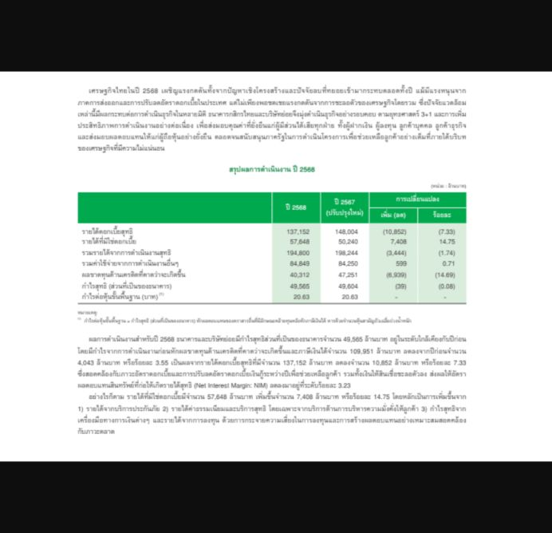

# ผลตรวจระบบ auto1 — 2 ตุลาคม 2026

## สรุปตรงไปตรงมา

ระบบตอบคำถามชุดวินิจฉัยเดิมได้ดีขึ้นและใช้โมเดลน้อยลง แต่ยังไม่สมบูรณ์สำหรับ PDF ไทยทุกประเภท โดยเฉพาะ Docling ออฟไลน์และการอ่านกราฟ/ตารางที่สูญเสียความสัมพันธ์เมื่อแปลงเป็นข้อความ

| การตรวจ | ผลล่าสุด | ความหมาย |
|---|---:|---|
| ทดสอบโค้ด | 202 ผ่าน / 5 ข้าม | ไม่ใช่เปอร์เซ็นต์ความแม่นยำเอกสาร; live tests ที่ข้ามไม่ถือว่าผ่าน |
| PDF สแกนเดิม 5 หน้า: คำถาม 15 ข้อ | **14/15 (93.3%)** จากเดิม 9/15 | ใช้ปรับโค้ดแล้ว จึงเป็น diagnostic set |
| รายงานไทยใหม่ PTT/PTTEP: พบหน้าเป้าหมายใน Top 5 | **16/16** | หน้าเป้าหมายอยู่ในผลค้นหา ไม่รับประกันว่าชิ้นข้อความมีเซลล์ที่ต้องใช้ครบ |
| รายงานใหม่: คำตอบถูก + มีหน้าเป้าหมายใน sources | **12/16 (75%)** | ผล rescore v2 จากคำตอบเดิม; ชุดเล็กและยังไม่มีผู้ตรวจเฉลยอิสระ |
| เว็บจริง: ถาม → ตอบ → เปิดภาพหน้า PDF | ผ่านตัวอย่างที่ทดสอบ | 49,565 ล้านบาท ปี 2568, PDF หน้า 1 |
| Offline: อัปโหลด/Docling/index/เปิดภาพหน้า | 5/5 หน้าประมวลผล, ภาพ HTTP 200 | ใช้ไฟล์จริงในฐานข้อมูลทดสอบแยก |
| Offline: ความถูกต้องของคำตอบ | **0/1** | ตอบ “ไม่พอ”; OCR อ่านหัวตารางและข้อความผิด จึงยังไม่ผ่าน end-to-end |

## สิ่งที่แก้แล้ว

1. **เลือกเครื่องมือจากข้อมูลที่มีจริง** ลดการสร้าง SQL ลงตารางที่ไม่มีข้อมูลและลดการเรียกโมเดลซ้ำ
2. **รักษาตัวตนของเซลล์** ผลค้นตารางเก็บเอกสาร หน้า แถว คอลัมน์/ปี ค่า และหน่วยร่วมกัน ใช้รายการเซลล์ที่มีอยู่ให้โมเดลเลือก แทนการปล่อยให้สร้างค่าเอง
3. **คำถามที่ตรงรายการแน่นอนตอบจากเซลล์ได้โดยตรง** ไม่เรียกโมเดลอีกครั้งเพื่อเขียนตัวเลขเดิม ลดทั้งเวลาและโอกาสเปลี่ยนค่า
4. **แยกหน่วยรายช่อง** บาทต่อหุ้น/ร้อยละไม่ถูกแทนด้วยหน่วยล้านบาทของทั้งตาราง; ปีหัวคอลัมน์ผิดรูปแบบถูกกักไว้
5. **จัดข้อความหลักฐานใหม่** ตัดหลักฐานซ้ำจากไฟล์ที่อัปโหลดซ้ำ และกระจายพื้นที่ข้อความให้หลักฐานท้ายรายการเข้าถึงโมเดลได้
6. **เปิดหน้าอ้างอิงแบบออฟไลน์ได้** แยกตัวแสดง PDF ออกจากบริการ OCR แก้ crash ของ LocalOCRService
7. **ตัวตรวจเข้มงวดขึ้นและรองรับรูปแบบคำตอบ** เครื่องหมาย/ปี/หน่วย/สเกลยังตรวจตามเดิม เพิ่มรูปแบบเลขหน้าและหน่วยดอลลาร์ย่อ โดยยอมรับตัวเลขประกอบได้เฉพาะที่มี reference รองรับ
8. **เก็บการทดลองเป็นรุ่น** คำตอบเต็ม, sources, trace, calls/tokens, เวลา, RSS, hashes และผลที่ไม่ผ่านถูกเก็บไว้ ไม่เลือกเก็บเฉพาะรอบดี

## 1. ชุดเดิม: เปรียบเทียบหลังนำเข้าใหม่กับหลังแก้ runtime

| รายการ | หลังนำเข้าใหม่ (ก่อนแก้ runtime) | รอบยืนยัน diagnostic v7 |
|---|---:|---:|
| คำตอบถูกและมีหน้าเป้าหมาย | 9/15 | **14/15** |
| มีหน้าเป้าหมายใน sources | 15/15 | 15/15 |
| Gemini calls สำเร็จ | 45 | **22** |
| SDK attempts รวม retry ที่แอปเห็น | 53 | **25** |
| เวลารวม | 296.9 วินาที | **58.4 วินาที** |
| Python RSS สูงสุด | ดูชุดเดิม | 263.1 MiB |

เวลาเป็นการสังเกตแต่ละรอบ ไม่ใช่ controlled speed benchmark: retry เครือข่าย, cache และงานอื่นบนเครื่องต่างกัน ไม่รวมทรัพยากรฝั่ง Google และ retry ภายใน SDK ที่ไม่ได้เปิดเผย

ข้อที่ยังไม่ผ่านคือ L11: reference ระบุ 4,558,618 ล้านบาท แต่ข้อความ OCR เป็น 4,558,818 ล้านบาท การลองอ่านใหม่ทั้งหน้าและบางส่วนไม่ได้แก้ปัญหา จึงไม่เขียนเลขจากเฉลยทับข้อมูลและไม่เปลี่ยน label เพื่อให้ผ่าน ภาพต้นฉบับค่อนข้างละเอียดต่ำและยังควรมีคนตรวจซ้ำ

รอบระหว่างพัฒนา v2–v7 ได้ 11, 6, 12, 11, 13, 14 ข้อตามลำดับ โดย v3 มีปัญหาเครือข่าย ส่วน v1 ไม่สมบูรณ์ เก็บผลทั้งหมดไว้ในแพ็กเกจ

## 2. รายงานไทยใหม่: ผลค้นหากับผลคำตอบต่างกันอย่างไร

PTT 233 physical PDF pages + PTTEP 535 physical PDF pages = 768 หน้า, 1,969 chunks ใช้ข้อความที่เลือกได้ใน PDF ไม่ได้เรียก OCR และไม่ได้ใช้ตารางจากฐานข้อมูลจริง มี isolated PostgreSQL และ DuckDB ว่างของการทดลองเอง

**ข้อจำกัดสำคัญ:** 16 คำถามเป็น single-fact และหลักฐานกระจุกอยู่ 3 physical PDF pages จึงเป็น exploratory pilot ไม่ใช่ final thesis benchmark ที่ครอบคลุมทั้งรายงาน การปรับ runtime ใช้ชุดเดิม; ไม่ปรับ retrieval/agent ตามผล pilot นี้

| วิธี | พบหน้าใน Top 5 | ค่าถูก (scorer v2) | ค่าถูก + มีหน้าเป้าหมายใน sources |
|---|---:|---:|---:|
| BM25 + Gemini | 13/16 | 12/16 | **11/16** |
| Dense bge-m3 | 10/16 | ไม่ได้สร้างคำตอบ | ไม่ได้สร้างคำตอบ |
| App hybrid + Gemini | **16/16** | 12/16 | **12/16** |

BM25 ส่ง 3 chunks ให้ตอบ; app ใช้ผลค้นและการจัด context ของระบบจริง จำนวนหลักฐานและ prompt จึงไม่เหมือนกัน เป็นการเทียบระบบ ไม่ใช่ ablation ที่ควบคุมทุกตัวแปร

คะแนนหน้าอ้างอิงตรวจจาก source list ที่คืนมา ไม่ใช่การพิสูจน์ว่าแต่ละประโยคอ้างเซลล์ที่ถูกต้อง เช่น F09 มีหน้า 5 อยู่ใน sources แต่ข้อความตอบอ้างหน้า 32 จึงต้องประเมิน citation precision แยกต่อไป

### การแก้ตัวตรวจโดยไม่เปลี่ยนคำตอบ

- v1: app 10/16, baseline 11/16 เมื่อรวมเงื่อนไขหน้า
- v2: app **12/16**, baseline **11/16**; ไม่เรียกโมเดลเพิ่ม
- F12: `หน้า: 6` ถูกนับเป็นตัวเลขคู่แข่งทั้งที่เป็นเลขหน้า แก้การอ่าน colon
- F09: ต้นฉบับหน้า 5 ระบุ 327,415 ล้านบาท เทียบเท่า 9,273 ล้านดอลลาร์ สรอ. เพิ่มหน่วยย่อและ reference ของจำนวนเงินสกุลที่สองแยกเป็น reference v2 ยังคงค่าเป้าหมาย/คำถาม/หน้าเดิม
- ไม่อนุญาตแปลงค่าเงินเอง ไม่ยอมรับจำนวนเงินประกอบอื่นที่ไม่มี label และมี regression tests สำหรับจำนวน/เครื่องหมาย/หน่วยผิด

### 4 ข้อที่ยังไม่ผ่านจริง

| ข้อ | สิ่งที่พบ | งานต่อไป |
|---|---|---|
| F06 | พบหน้า แต่บริบทที่ส่งไม่ครบค่าจากกราฟเงินสดลงทุน จึงปฏิเสธตอบ | เก็บความสัมพันธ์ label–series–year–value ของกราฟ |
| F07 | หลักฐาน PTT ปะปน PTTEP และชิ้นข้อความหน้าเป้าหมายไม่มีรายการครบ | document/company scope และการส่งส่วนที่มีค่าจริง |
| F10 | ตอบล้านดอลลาร์ ทั้งที่ถามล้านบาท | เลือก measure/year/currency ตามคำถามพร้อมหลักฐาน |
| F16 | หยิบสัดส่วน 76% จากคนละบริบท แทน 73% ของส่วนที่ถาม | ผูก section/chart series กับค่า; ห้ามแทนกันเพราะอยู่เอกสารเดียวกัน |

### Calls และทรัพยากร

- BM25: 16 calls สำเร็จ, 16 attempts, เวลาตอบรวม 45.55 วินาที
- App: 16 calls สำเร็จ, 24 attempts รวม errors/retries, เวลาตอบรวม 149.0 วินาที
- รวม 160,341 input tokens, 759 output tokens, thinking 0
- สร้าง embeddings/index/ค้น/ตอบรวม **2,973.82 วินาที (~49.6 นาที)**
- Python RSS สูงสุด **458.5 MiB**; Ollama ที่ sampler จับได้ 90.9 MiB นี้ไม่ครอบคลุม VRAM และไม่ควรใช้เป็น RAM ทั้งระบบ
- ทรัพยากร GPU ไม่ได้บันทึกตลอดการทดลองนี้ จึงไม่มีตัวเลข peak VRAM ที่พิสูจน์แล้ว

## 3. Offline จริง: ผ่านเรื่องการทำงานบางส่วน แต่ความถูกต้องยังไม่ผ่าน

ใช้ Docling/TableFormer + Thai/English EasyOCR และโมเดลในเครื่องกับ PDF สแกน 5 หน้า ไม่ใช้ cloud fallback

- DNS/TCP ออกภายนอกจาก process ของแอปถูกบล็อก; scraping API ตอบ 403
- อัปโหลดและทำดัชนีครบ 5 หน้า; หลังแก้ renderer เปิดภาพหน้าอ้างอิงได้ HTTP 200
- มี 9 unresolved rows ถูกกักออกจาก structured search/warehouse; สถานะ indexed ไม่ได้แปลว่า OCR ถูก
- คำถามรายได้ดอกเบี้ยสุทธิ 137,152 ล้านบาทตอบ “ไม่พอ” เพราะ local OCR สูญเสียข้อความและหัวตาราง จึง **ไม่ผ่านความถูกต้อง 0/1**
- ใช้เวลารวม **584.20 วินาที (~9.7 นาที)**; peak app + OCR workers RSS **4,832.1 MiB (~4.72 GiB)**, local generation 1 call
- เป็น process-level network block ไม่ใช่ OS firewall proof และยังไม่ใช่ full upload→answer ของไฟล์ 200–500 หน้า

## 4. เดโมเว็บที่ตรวจแล้ว

คำถาม: “จากไฟล์ 1testfile.pdf กำไรสุทธิส่วนที่เป็นของธนาคารปี 2568 เท่ากับกี่ล้านบาท?”

คำตอบ: “ปี 2568 49,565 ล้านบาท (PDF หน้า 1) (ค่าถอดจาก OCR; ยังไม่ตรวจเทียบ PDF)”

ทดสอบผ่าน UI จริงบน localhost: ส่งคำถาม → ได้คำตอบ → คลิกลิงก์ → เปิดภาพหน้า 1 สำเร็จ ไม่ใช่ภาพจำลองหรือคำตอบที่ใส่เอง ลิงก์ปรากฏสองรายการเพราะฐานข้อมูลมีการอัปโหลดไฟล์เดียวกันสองครั้ง

## งานที่ยังต้องทำก่อนใช้คำว่า “สมบูรณ์”

1. ปรับ local OCR บนตัวอย่างไทยที่อ่านผิด แล้วทดสอบ end-to-end อีกครั้งโดยไม่เปลี่ยนเฉลยตาม OCR
2. ตรวจและรักษาความสัมพันธ์กราฟ/ตารางให้ครบ พร้อม scope บริษัท/section/ปี/สกุลเงิน และวัดระดับเซลล์/ข้อความอ้างอิง
3. ให้ผู้ตรวจอิสระตรวจเฉลยและ alternate evidence pages; ปัจจุบันเป็น AI visual review
4. จัด final test ที่มีคำถามหลากหลายและกระจายหลายหน้า/หลายรายงาน ล็อกก่อนรัน ห้ามนำผลที่ดูแล้วมาอ้างว่า unseen รอบใหม่
5. ทดสอบ OS-level outbound block และ full API workflow/interruption/resume บนไฟล์ยาวจริง งาน OCR ยาวที่ทำก่อนหน้าไม่เท่ากับการทดสอบ end-to-end นี้

หลักฐานและคำสั่งทำซ้ำ: [runtime repair package](../TestFile/runtime_repair_2026-10-01_v1/README.md) และ [ผลก่อนแก้ runtime](../TestFile/postmerge_2026-10-01_v1/README.md)
